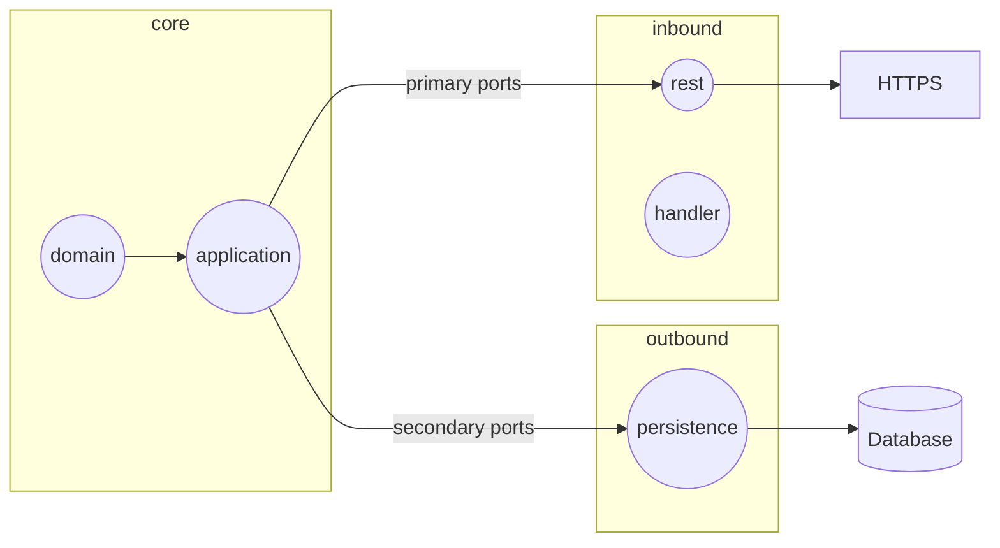

# Done tasks

- **Hexagonal architecture** [#6521d6e](https://github.com/Danaes/control-api/commit/6521d6e45d129d13a4933ed95fb0aef24f7532fa)

- **Login system with JWT** [#6521d6e](https://github.com/Danaes/control-api/commit/6521d6e45d129d13a4933ed95fb0aef24f7532fa)
  - Add extension quarkus-smallrye-jwt
  - Create private and public key
  - Add properties to application.yaml
  - Create endpoint to sign up
  - Create endpoint to login

- **Exception handler** [#0e21cf5](https://github.com/Danaes/control-api/commit/0e21cf5fb532d2f14f3c547aa66d789a472f35a6)
  - Create custom exceptions
  - Add class with @Provider annotation

- **Authorization of endpoints** [#550cbb3](https://github.com/Danaes/control-api/commit/550cbb3ea1fd368845f237faa3c627e5ca708561)
  - Add @RolesAllowed annotation

---
# In progress task

---
# Todo tasks

- **Testing**
  - Unit tests
  - Integration tests