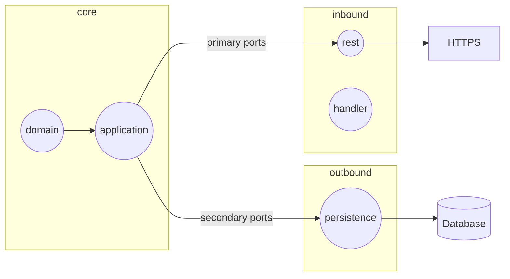

# Done tasks
- **Hexagonal architecture**
  - common -> shared package between bounded contexts
    - core.application
  - layers
    - inbound
      - rest
      - exception.handler
    - outbound
      - persistence
    - core
      - application
      - domain

- **Login system with JWT**
  - Add extension quarkus-smallrye-jwt
  - Create private and public key
  - Add properties to application.yaml
  - Create endpoint to sign up
  - Create endpoint to login

- **Exception handler**
  - Create custom exceptions
  - Add class with @Provider annotation

---
# In progress task

- **Authorization of endpoints**
  - Add @RolesAllowed annotation

---
# Todo tasks

- **Testing**
  - Unit tests
  - Integration tests